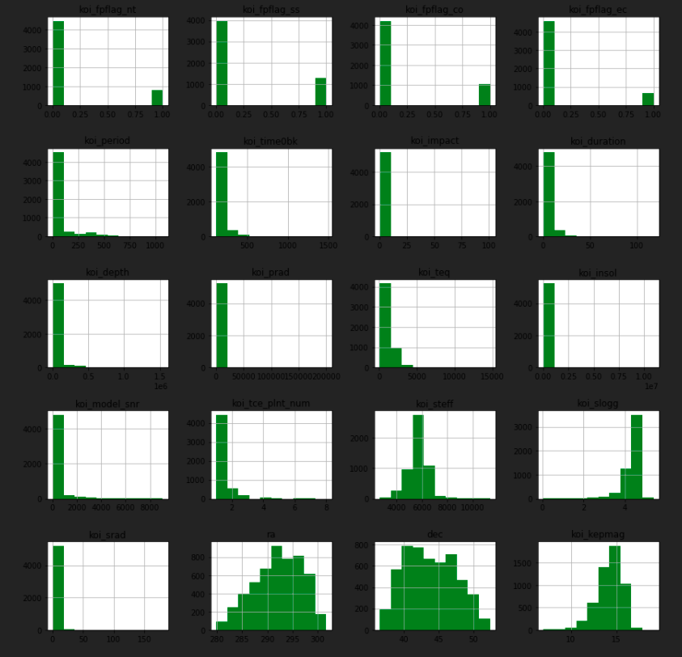
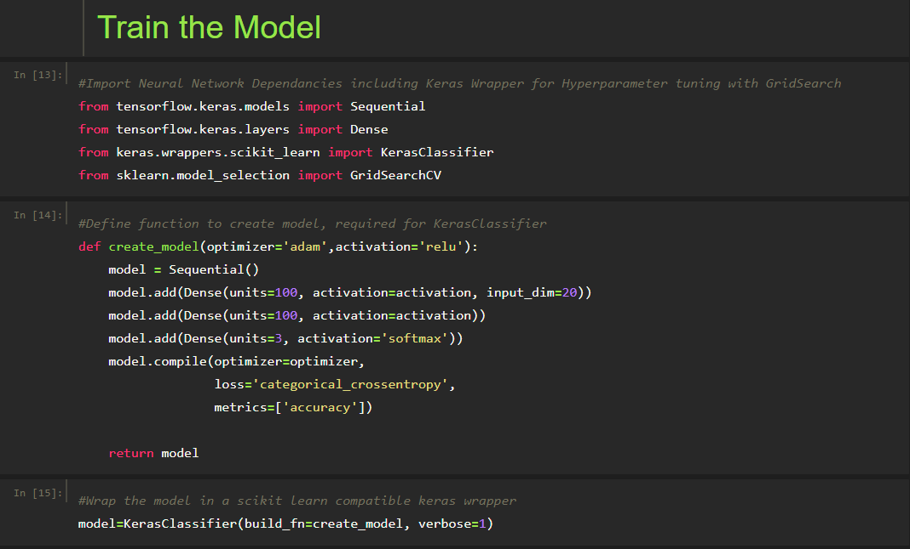
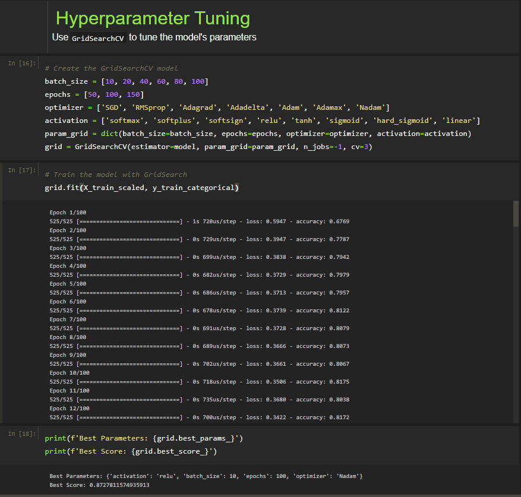
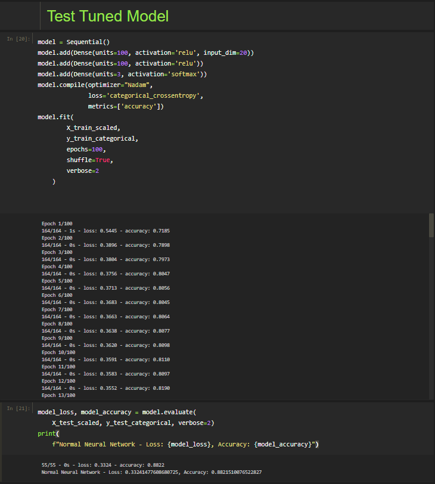
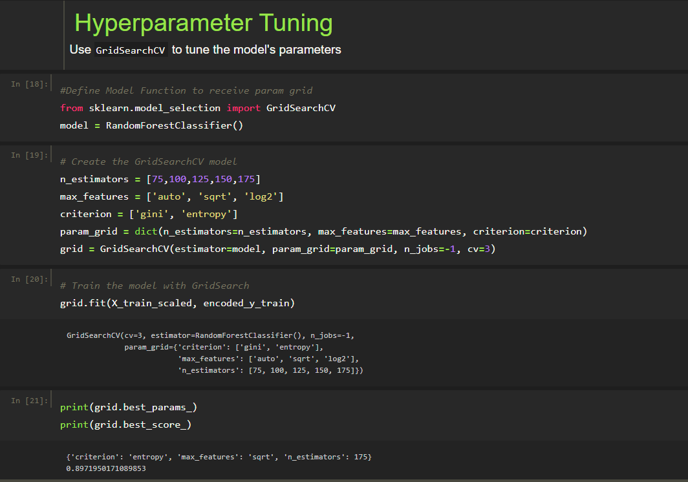
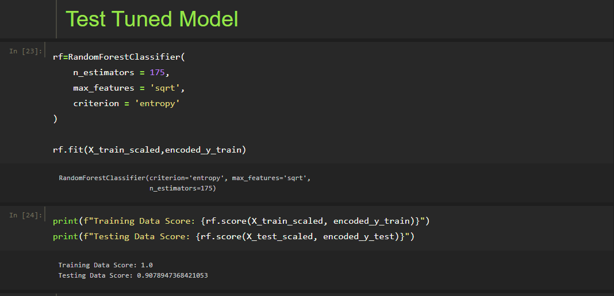

# Exoplanet Exploration {Machine Learning with SciKit-Learn}

---
## Background & Challenge

Over a period of nine years in deep space, the NASA Kepler space telescope has been out on a planet-hunting mission to discover hidden planets outside of our solar system.

To help process this data, create machine learning models capable of classifying candidate exoplanets from the [raw dataset](https://www.kaggle.com/nasa/kepler-exoplanet-search-results).

---
## ML Model Development Toolkit

>* Python
>* [SciKit Learn](https://scikit-learn.org/stable/)
>* [Keras](https://keras.io/)
>* [TensorFlow](https://www.tensorflow.org/)

---
## Data Attributes
* **koi_disposition** (target): The category of this KOI from the Exoplanet Archive. Current values are CANDIDATE, FALSE POSITIVE, NOT DISPOSITIONED or CONFIRMED. All KOIs marked as CONFIRMED are also listed in the Exoplanet Archive Confirmed Planet table. Designations of CANDIDATE, FALSE POSITIVE, and NOT DISPOSITIONED are taken from the Disposition Using Kepler Data.

* **koi_fpflag_nt**: A KOI whose light curve is not consistent with that of a transiting planet. This includes, but is not limited to, instrumental artifacts, non-eclipsing variable stars, and spurious (very low SNR) detections.

* **koi_fpflag_ss**: A KOI that is observed to have a significant secondary event, transit shape, or out-of-eclipse variability, which indicates that the transit-like event is most likely caused by an eclipsing binary. However, self-luminous, hot Jupiters with a visible secondary eclipse will also have this flag set, but with a disposition of PC.

* **koi_fpflag_co**: The source of the signal is from a nearby star, as inferred by measuring the centroid location of the image both in and out of transit, or by the strength of the transit signal in the target's outer (halo) pixels as compared to the transit signal from the pixels in the optimal (or core) aperture.

* **koi_fpflag_ec**: The KOI shares the same period and epoch as another object and is judged to be the result of flux contamination in the aperture or electronic crosstalk.

* **koi_period**: The interval between consecutive planetary transits.

* **koi_time0bk**: The time corresponding to the center of the first detected transit in Barycentric Julian Day (BJD) minus a constant offset of 2,454,833.0 days. The offset corresponds to 12:00 on Jan 1, 2009 UTC.

* **koi_impact**: The sky-projected distance between the center of the stellar disc and the center of the planet disc at conjunction, normalized by the stellar radius.

* **koi_duration**: The duration of the observed transits. Duration is measured from first contact between the planet and star until last contact. Contact times are typically computed from a best-fit model produced by a Mandel-Agol (2002) model fit to a multi-quarter Kepler light curve, assuming a linear orbital ephemeris.

* **koi_depth**: The fraction of stellar flux lost at the minimum of the planetary transit. Transit depths are typically computed from a best-fit model produced by a Mandel-Agol (2002) model fit to a multi-quarter Kepler light curve, assuming a linear orbital ephemeris.

* **koi_prad**: The radius of the planet. Planetary radius is the product of the planet star radius ratio and the stellar radius.

* **koi_teq**: Approximation for the temperature of the planet. The calculation of equilibrium temperature assumes a) thermodynamic equilibrium between the incident stellar flux and the radiated heat from the planet, b) a Bond albedo (the fraction of total power incident upon the planet scattered back into space) of 0.3, c) the planet and star are blackbodies, and d) the heat is evenly distributed between the day and night sides of the planet.

* **koi_insol**: Insolation flux is another way to give the equilibrium temperature. It depends on the stellar parameters (specifically the stellar radius and temperature), and on the semi-major axis of the planet. It's given in units relative to those measured for the Earth from the Sun.

* **koi_model_snr**: Transit depth normalized by the mean uncertainty in the flux during the transits.

* **koi_tce_plnt_num**: TCE Planet Number federated to the KOI.

* **koi_steff**: The photospheric temperature of the star.

* **koi_slogg**: The base-10 logarithm of the acceleration due to gravity at the surface of the star.

* **koi_srad**: The photospheric radius of the star

* **ra**: KIC Right Ascension

* **dec**: KIC Declination

* **koi_kepmag**: Kepler-band (mag)

---
## ML Model Selection & Analysis

### Selected Models
* **Neural Network (Keras)**: A neural network is a series of algorithms that endeavors to recognize underlying relationships in a set of data through a process that mimics the way the human brain operates. In this sense, neural networks refer to systems of neurons, either organic or artificial in nature.

* **Random Forest (SciKit-Learn)**: Random Forest is a robust machine learning algorithm that can be used for a variety of tasks including regression and classification. It is an ensemble method, meaning that a random forest model is made up of a large number of small decision trees, called estimators, which each produce their own predictions.

### Balance Check
---

### Neural Network Tuning, Testing, & Analysis
---
From the figures below we find that the GridSearch optimized Neural Network model produced a test accuracy of roughly 88%. Due to the time intensive nature of optimizing neural network models, this model may be improved with addtional paramater customization and development given addtional run time and compute capacity. 

### Random Forest Tuning, Testing, & Analysis
---
From the figures below we find that the GridSearch optimized Random Forest model produced a test accuracy of roughly 91%. A simpler model than the neural netwok, the random forest seeks to drive successive conclusions toward leaf nodes based on the correlation of given attributes. 

### Conclusion & Recommendations
---
Both models are scoring quite similiary to their respective test data sets and have been included in this repository for further discussion and optimization. However, if one had to pick, the Random Forest classification model does come in slightly higher on test accuracy than the current optimized neural network model. 

I would recommend that additional time be put into optimization of the neural network model, as their should be a set of parameters that lead to convergence. The current two hour run times are prohibitive for this researcher. 